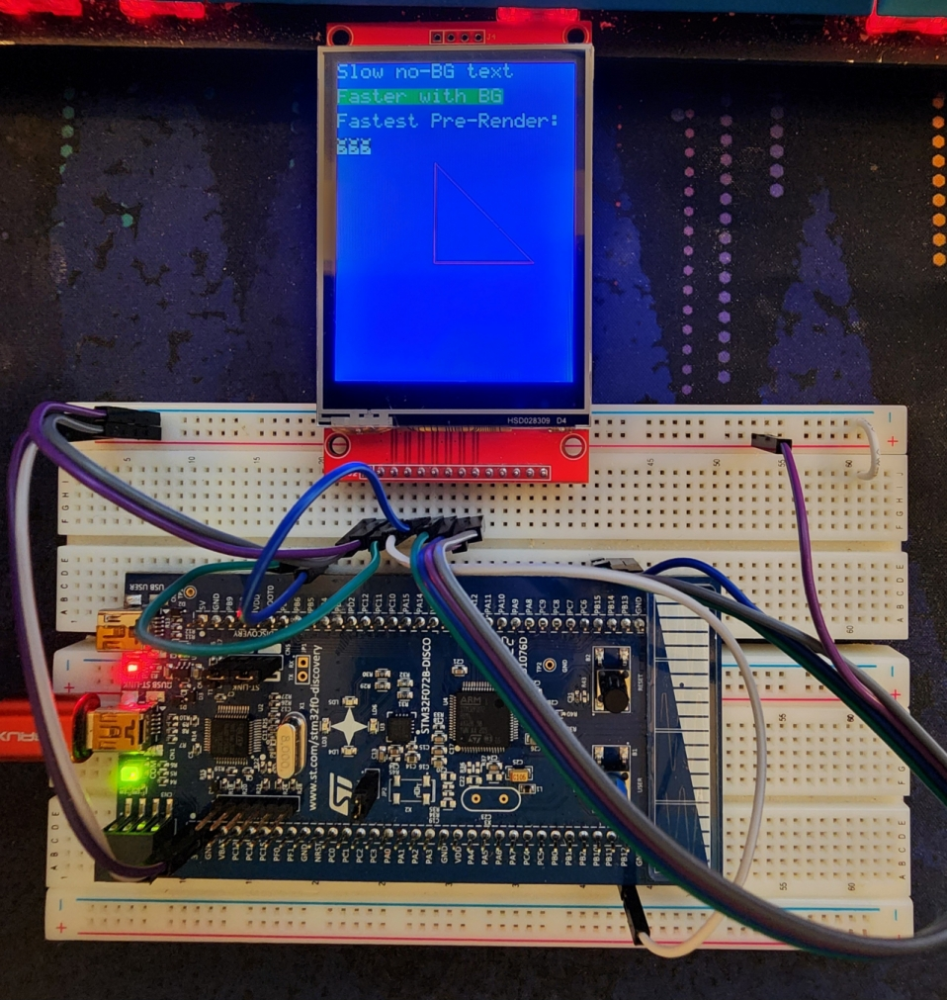

# ILI9341-STM32F072B #

## Overview ##

This is a demonstration of a ILI9341 LCD using SPI connected to a STM32F072B Discovery board. My purpose for this project was to work in a redicilously resource constrained environment, and to that end it works quite well.

## Connections ##

| Board | LCD |
| ------------- | ------------- |
| PB5 | DISP_DC |
| PB6 | SPI_CS |
| PB15 | SPI_MOSI |
| PB14 | SPI_MISO |
| PC13 | PI_SCK |
| PB12 | DISP_RESET |
| PA9 | USART1_TX |
| PA10 | USART1_RX |
| 3V | VCC |
| 3V | LCD |
| GND | GND |

## Demonstration ##
The demonstration draws the following:
1. Draws red, green and blue to the screen pixel-by-pixel
2. Draws text pixel-by-pixel
3. Draws text using a faster process with a background
4. Draws a counter from 000-999 using pre-rendered text (this is the fastest way to draw text)
5. Draws a right triangle using vertical line, horizontal line and arbitrary line functions

## Note on speed ##

Full screen writes take about 600ms if dealing with arbitrary pixels. The bottleneck here is the speed of memory writes, a buffer transfered via the DMA repetitively (to draw a pattern or solid color) will alow for ~3fps.
